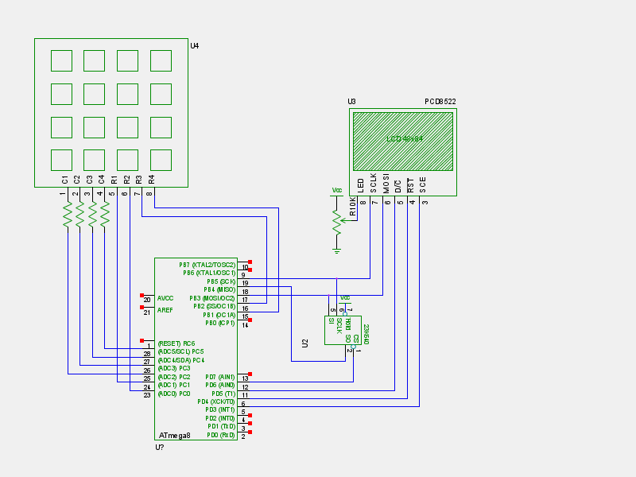

# CHIP-8 implementation for a very simple breadboard toy

This is a CHIP-8 virtual machine implementation running on AVR. 

Its big party trick is that **it is written in Rust**: it is the first
non-trivial Rust application running on AVR. You can read about its
development process in [my blog post][blog]. The CHIP-8 VM itself is
implemented in a [separate, portable crate][chip8-engine] written in
idiomatic Rust fashion, heavily using algebraic data types and pattern
matching; this crate can then be used both to build
an [SDL-based desktop app][chip8-sdl] and also this crate running on
AVR microcontrollers.

The intended hardware is a simple circuit with very few components:

* AVR ATMega328P microcontroller
* PCD8522 84x48 monochrome LCD
* Microchip 23K640 serial RAM
* 4x4 keypad
* 10K resistors (4 pcs)
* 10K trimpot

All of these components come in throughhole versions so it is very
easy to build it on a breadboard. **NOTE THE RAM CHIP DOESN'T SUPPORT
5 Volts. The board is meant to be powered at 3.3 Volts.** An Arduino
Uno is going to fry the RAM chip.




# Building

AVR support in Rust is not yet available its mainline
version, and there are some questionable hacks that I had to add to
work around some compiler bugs and missing features. All this means
you'll need to build very specific versions of LLVM and Rust to be
able to compile this crate. Also, because of some remaining bugs in
the LLVM AVR backend, Rust's stock `libcore` cannot be compiled yet;
we need to use Xargo to link to a slightly stripped down version.

## 1. Install the Rust nightly compiler and the rust-src rustup component

Install [rustup](https://rustup.rs/).

Then install the Rust nightly compiler, and then add the `rust-src` component to Rustup.

```bash
# add the rust-src component which is used for building libcore
rustup component add rust-src
```

## 2. Enable the nightly compiler by default with `rustup`

```bash
$ rustup default nightly
```

## 3. Build `chip8-avr` and all its dependencies using Xargo

```bash
$ git clone https://github.com/gergoerdi/rust-avr-chip8-avr chip8-avr
$ cd chip8-avr
$ sh build.sh
```

# Running

The above process will result in the AVR ELF executable
`target/avr-atmega328p/release/chip8-avr.elf`. This executable can be
uploaded to the ATMega328P via an AVR programmer; or if you use
something like an Arduino Pro 3.3V or an Adafruit Trinket Pro 3.3V,
you can upload it directly via USB.

Another way of trying it out is simulation: I've implemented
a [SimAVR-based simulator][simavr] for the above schematics that
almost runs in real time, as an interactive SDL app.

# What's next?

There is no shortage of [Rust and LLVM bugs and missing features][bugs]
in the AVR backends, if you want to help out.


[blog]: https://gergo.erdi.hu/blog/2017-05-12-rust_on_avr__beyond_blinking/
[chip8-engine]: https://github.com/gergoerdi/rust-avr-chip8-engine
[chip8-sdl]: https://github.com/gergoerdi/rust-avr-chip8-engine
[xargo-rustup]: https://github.com/japaric/xargo/issues/138
[simavr]: https://github.com/gergoerdi/rust-avr-chip8-simulator
[bugs]: https://github.com/avr-rust/rust/issues
